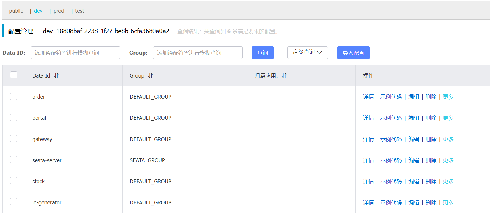
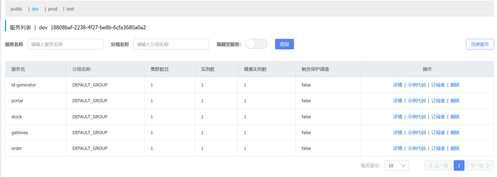
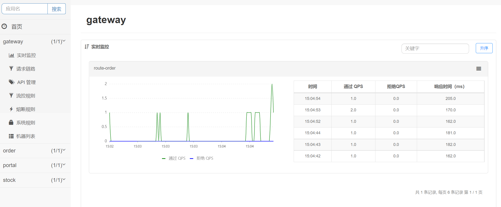
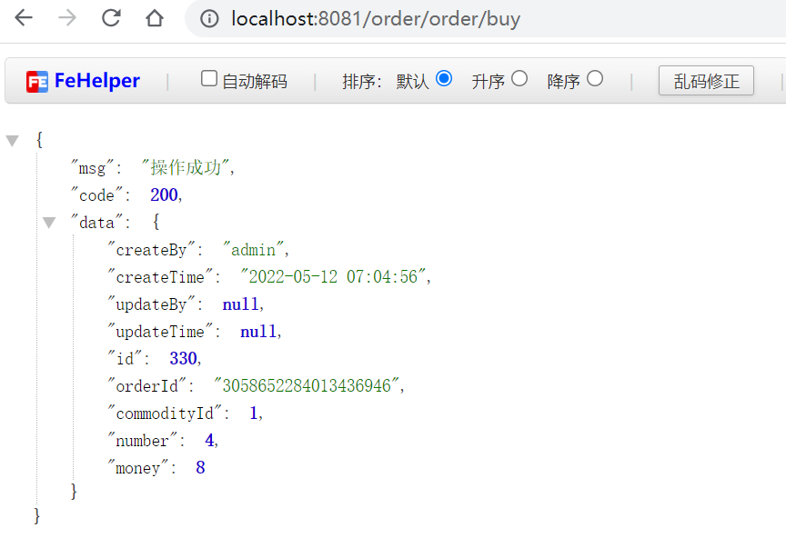
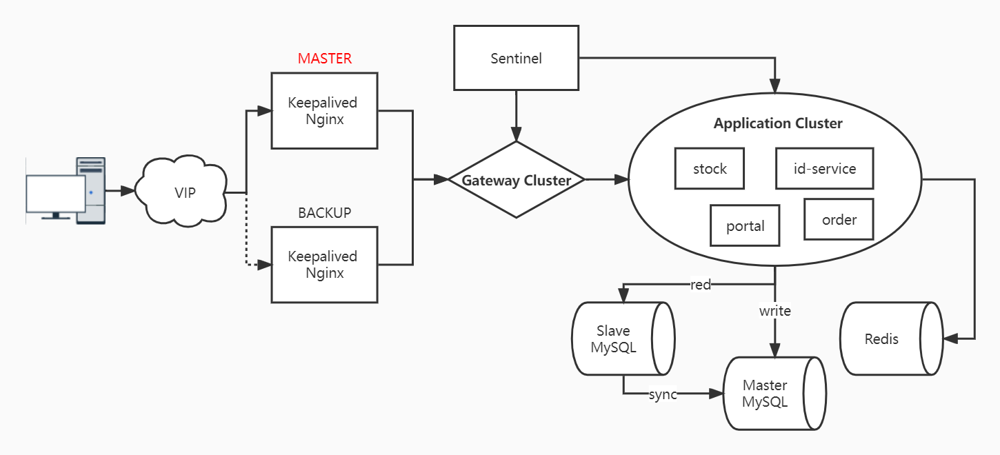

# Micro 微服务集成测试
### [快速开始](#quick_start)  [分布式部署v1](#distributed_deploymen)

## 微服务版本
- spring-boot: 2.6.3
- spring-cloud: 2021.0.1
- spring-cloud-alibaba: 2021.0.1.0

## 相关组件：
- 网关：Gateway
- 配置中心&服务注册与发现：Nacos
- RPC：OpenFeign
- 熔断限流：Sentinel
  * 修改部分sentinel-dashboard源码，将规则配置保存到Nacos中
- 连接池：Druid
- 数据库：MySql
- 缓存：Redis
- 分布式事务：Seata
  * 使用AT模式
- 分布式锁：Redisson
- 分布式ID：[uid-generator](micro-modules/ms-id)
  * 使用Spring Boot重写百度的[uid-generator](https://github.com/baidu/uid-generator)
  * 使用Feign以及HTTP方式暴露ID获取API
  * 提取参数配置至yaml
```yaml
# UID Generator
uid-generator:
  # 对于并发数要求不高、期望长期使用的应用, 可增加timeBits位数, 减少seqBits位数.
  # 例如节点采取用完即弃的WorkerIdAssigner策略, 重启频率为12次/天, 那么配置成{"workerBits":23,"timeBits":31,"seqBits":9}时,
  # 可支持28个节点以整体并发量14400 UID/s的速度持续运行68年.

  # 对于节点重启频率频繁、期望长期使用的应用, 可增加workerBits和timeBits位数, 减少seqBits位数.
  # 例如节点采取用完即弃的WorkerIdAssigner策略, 重启频率为24*12次/天, 那么配置成{"workerBits":27,"timeBits":30,"seqBits":6}时,
  # 可支持37个节点以整体并发量2400 UID/s的速度持续运行34年.
  timeBits: 29
  workerBits: 21
  seqBits: 13
  epochStr: 2016-09-20
  # RingBuffer size扩容参数, 可提高UID生成的吞吐量.
  # 默认:3， 原bufferSize=8192, 扩容后bufferSize= 8192 << 3 = 65536
  boostPower: 3
  # 指定何时向RingBuffer中填充UID, 取值为百分比(0, 100), 默认为50
  # 举例: bufferSize=1024, paddingFactor=50 -> threshold=1024 * 50 / 100 = 512.
  # 当环上可用UID数量 < 512时, 将自动对RingBuffer进行填充补全
  paddingFactor: 30
  # 另外一种RingBuffer填充时机, 在Schedule线程中, 周期性检查填充
  # 默认:不配置此项, 即不实用Schedule线程. 如需使用, 请指定Schedule线程时间间隔, 单位:秒
  scheduleInterval: 60
```
- 读写分离：[AbstractRoutingDataSource](micro-core/core-mybatis/src/main/java/com/laiyw/micro/mybatis/dynamic/DynamicDataSource.java) + [Mybatis Interceptor](micro-core/core-mybatis/src/main/java/com/laiyw/micro/mybatis/interceptor/DynamicDataSourceInterceptor.java)
  * 实现一主多从
  * 实现多Slave下的获取方式配置；loop(轮询)、random(随机)
  * 可动态配置数据源，无需重启
  * 当有事务时默认使用Master库
  * master库必须配置，slave库按需配置(key可随意配置但不能重复；eg: slave, slave02, 112_ms)
```yaml
spring:
  datasource:
    druid:
      # 获取slave数据源方式：轮询:loop、随机:random，slave数据源只有一个时不生效
      slave-change-strategy: loop
      data-sources:
        master:
          driver-class-name: com.mysql.cj.jdbc.Driver
          url: jdbc:mysql://127.0.0.1:3306/micro-stock?useUnicode=true&characterEncoding=utf8&zeroDateTimeBehavior=convertToNull&useSSL=true&serverTimezone=Asia/Shanghai&nullCatalogMeansCurrent=true
          username: root
          password: root
        slave:
          driver-class-name: com.mysql.cj.jdbc.Driver
          url: jdbc:mysql://192.168.47.112:3306/micro-stock?useUnicode=true&characterEncoding=utf8&zeroDateTimeBehavior=convertToNull&useSSL=true&serverTimezone=Asia/Shanghai&nullCatalogMeansCurrent=true
          username: root
          password: root
        micro-mysql:
          driver-class-name: com.mysql.cj.jdbc.Driver
          url: jdbc:mysql://192.168.47.113:3306/micro-stock?useUnicode=true&characterEncoding=utf8&zeroDateTimeBehavior=convertToNull&useSSL=true&serverTimezone=Asia/Shanghai&nullCatalogMeansCurrent=true
          username: root
          password: root
```
## <span id="quick_start">快速开始</span>
### 步骤1：环境准备
- [Java8](http://www.oracle.com/technetwork/java/javase/downloads/jdk8-downloads-2133151.html)
- [MySQL](https://dev.mysql.com/downloads/mysql/)
- [Maven](https://maven.apache.org/download.cgi)
- [Redis](https://github.com/redis/redis/tags)

### 步骤2：建库
在数据库中分别创建如下Schema，文件在[Sql](Sql)目录：
- [micro-nacos](Sql/micro-nacos.sql)
- [micro-order](Sql/micro-order.sql)
- [micro-portal](Sql/micro-portal.sql)
- [micro-seata](Sql/micro-seata.sql)
- [micro-stock](Sql/micro-stock.sql)
- [micro-uid-generator](Sql/micro-uid-generator.sql)

### 步骤3：修改配置
**当前项目以Nacos的namespace区分环境；在各服务的bootstrap.yaml文件中指定spring.profiles.active的值，并在bootstrap-环境字符.yaml文件中指定Nacos中namespace ID**

根据自身环境修改如下配置文件或者在Nacos的dev环境中修改，Nacos的配置会覆盖本地配置。
- [id-service](micro-modules/ms-id/id-service/src/main/resources/bootstrap-dev.yaml)
- [gateway](micro-gateway/src/main/resources/bootstrap-dev.yaml)
- [portal](micro-services/ms-portal/portal-service/src/main/resources/bootstrap-dev.yaml)
- [stock](micro-services/ms-stock/stock-service/src/main/resources/bootstrap-dev.yaml)
- [order](micro-services/ms-order/order-service/src/main/resources/bootstrap-dev.yaml)

### 步骤4：中间件配置&启动
- nacos
  1. 下载[nacos](https://github.com/alibaba/nacos/tags), 解压后将target目录拷贝至micro/nacos中
  2. 运行[nacos/bin/startup.cmd](nacos/bin/startup.cmd)
  3. http://localhost:8848/nacos
  4. 账号/密码：nacos/nacos
- sentinel-dashboard: 
  1. 运行[sentinel-dashboard/startup.cmd](sentinel-dashboard/startup.cmd)
  2. http://localhost:8858
  3. 账号/密码：sentinel/sentinel
- seata: 
  1. 在[seata](seata)目录中创建logs目录
  2. 运行[seata/bin/seata-server.bat](seata/bin/seata-server.bat)

### 步骤5：启动服务
- [gateway](micro-gateway/src/main/java/com/laiyw/micro/gateway/GatewayApplication.java)
- [id-service](micro-modules/ms-id/id-service/src/main/java/com/laiyw/micro/id/IDGeneratorApplication.java)
- [portal-service](micro-services/ms-portal/portal-service/src/main/java/com/laiyw/micro/portal/service/PortalServiceApplication.java)
- [stock-service](micro-services/ms-stock/stock-service/src/main/java/com/laiyw/micro/stock/service/StockServiceApplication.java)
- [order-service](micro-services/ms-order/order-service/src/main/java/com/laiyw/micro/order/service/OrderServiceApplication.java)

### 步骤6：简单示例
- nacos



- sentinel-dashboard


- 模仿下单，该操作涉及如下技术点
  - RPC: OpenFeign(调用库存和用户服务)
  - 分布式ID: uid-generator(用于生成订单编号；仅作测试使用，实际应用中不建议用来生成订单编号)
  - 分布式锁: Redisson(扣除库存)
  - 分布式事务: Seata AT模式(多服务下保证数据一致性)
  ```http request
  GET http://localhost:8081/order/order/buy
  ```
  

## <span id="distributed_deploymen">分布式部署v1</span>
**本次部署暂未接入CI/CD，全部在本地虚拟机上采用docker-compose实现组件和服务的安装部署；
集成nginx + keepalived实现服务的高可用；**

- 组件安装docker-compose：[docker-compose-soft.yaml](install/docker-compose-soft.yaml)
  - nginx参考配置[nginx.conf](install/nginx.conf)
  - mysql参考配置[master-my.cnf](install/mysql-conf/master-my.cnf), [slave-my.cnf](install/mysql-conf/slave-my.cnf)；部分SQL命令可参考[command.sql](install/command.sql)
  - redis参考配置[redis.conf](install/redis.conf)（依赖配置启动，需要安装前配置好）
  - seata-server参考配置[registry.conf](install/registry.conf)（依赖配置启动，需要安装前配置好）
- 服务启动docker-compose：[docker-compose-service.yaml](install/docker-compose-service.yaml)
  - Nacos客户端日志目录：-DJM.LOG.PATH
  - Sentinel客户端日志目录：-Dcsp.sentinel.log.dir

### 系统架构

